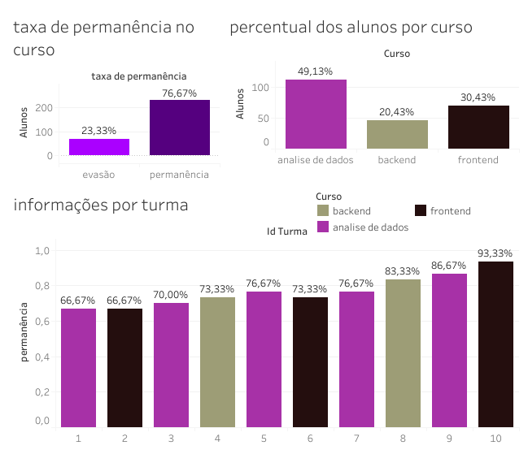

# zenior

## quem somos?
Nós somos uma empresa que busca revolucionar a maneira como as empresas enxergam os dados, com foco na estrutura, automação e visualização de dados
## zenior & resilidata
A Resilia busca modernizar seu processo de armazenamento de dados e gerenciamento da estrutura de ensino. Atualmente, as informações do braço de ensino da empresa estão dispersas em várias planilhas, dificultando o compartilhamento de dados estratégicos. O objetivo é criar uma solução eficiente que centralize essas informações em um banco de dados, permitindo a geração de insights valiosos.

A abordagem proposta envolve a criação da representação das entidades e seus atributos, a modelagem do banco de dados e a criação de scripts SQL para criar as tabelas e inserir os dados relevantes. Com um banco de dados bem protegido, a equipe da Resilia terá acesso rápido e confiável às informações estratégicas para a área de ensino.

Os benefícios dessa modernização são diversos. A empresa poderá tomar decisões embasadas em dados confiáveis, otimizar os cursos e módulos oferecidos, melhorar continuamente o processo de ensino e aumentar a eficiência e qualidade dos serviços prestados.

Os próximos passos incluem a implementação da modelagem do banco de dados, a inserção dos dados relevantes e a execução de consultas para gerar informações estratégicas. Será fundamental monitorar e ajustar continuamente o sistema para garantir a eficiência e adequação das informações transmitidas.

Essa modernização permitirá que a Resilia aproveite o poder dos dados para seu crescimento e sucesso. Com uma infraestrutura sólida de armazenamento e gerenciamento de dados, a empresa estará preparada para enfrentar os desafios do futuro e tomar decisões estratégicas com base em insights valiosos.

### modelo conceitual

Após uma conversa detalhada com a equipe da Resilia, chegamos a um modelo conceitual que nos deu uma boa compreensão das entidades e dos relacionamentos necessários. O modelo é o seguinte:

### Kanban
A partir desse modelo, decidimos fragmentar e dividir os requisitos do projeto. Para essa organização, optamos por utilizar o modelo Kanban para organizar a execução de nossas atividades. Dividimos as tarefas em três colunas: "A fazer", "Em andamento" e "Concluído", a fim de evitar retrabalho e ter um maior controle sobre nossa produtividade.

essa e uma amostra do nosso kanban durante o projeto

### modelo logico
Após mais algumas reuniões e horas de trabalho, construímos nosso modelo lógico, que inclui entidades, atributos, chaves primárias e chaves estrangeiras. O modelo é o seguinte:
para melhor visualização click na imagem

para melhor visualização click na imagem

## passo a passo para a utilização do projeto

Com base em tudo o que foi discutido, criamos os scripts que estão armazenados neste repositório. Agora, vamos ao passo a passo para utilizar o projeto.

1. O primeiro passo é baixar o repositório em sua máquina.

2. Em seguida, crie um banco de dados exclusivo para o projeto.

3.No terceiro passo, execute os scripts a partir do arquivo `entidades_funções_views.sql`, seguido pelo arquivo `inserts_populacao.sql.` Após essa etapa, o projeto estará pronto para consultas. 

4. para fazer as consultas utilize o arquivo `pesquisas.sql`
que ja possui as pesquisas antes pedidas.

## consultas solicitadas

o nosso projeto teria quê ajudar a responder algumas perguntas que eram

* quantidade de estudantes  cadastrados

* quais pessoas facilitadoras atuam em mais de uma turma

* percentual de evasão dividido por turma 

* a quais cursos os facilitadores estão aptos a facilitar

* informações gerais da turma como, quantidade de alunos, facilitadores, data de inicio e termino.

### visualização 
 
como a visualização de dados pelas tabelas deixam muito a desejar, resolvemos como um extra cruar uma pequena visualização
das informações principais do nosso banco de dados. 

Para acessar o dashboard, clique na imagem abaixo.

#### integrantes
* **Alex Santana** co-facilitador
* **David williams** gestor de conhecimento
* **Rodrigo marques** gestor de gente e enganjamento
* **Fernando Casanova** colaborador
* **Pâm carvalho** colaborador 

#### ferramentas utilizadas
**discord**
**whatsapp**
**trello**
**canva**
**pgadmin**
**github**
**tableau**
**db diagrams**

Agradeço pela paciência até aqui e muito obrigado!

